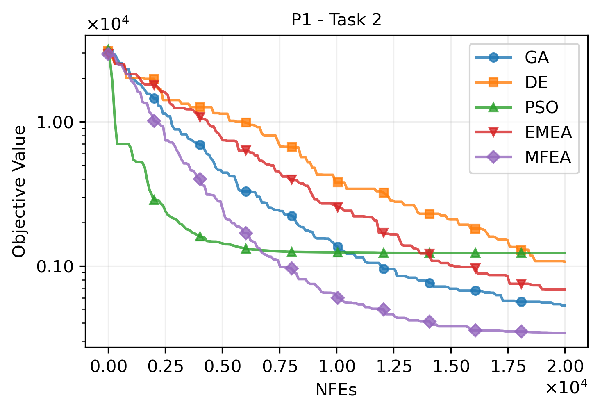
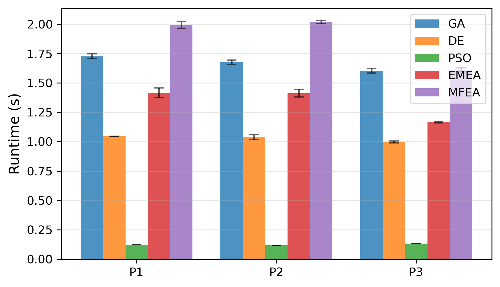

# DDMTOLab

<p align="center">
  
</p>

<p align="center">
  <strong>A Comprehensive Python Platform for Data-Driven Multitask Optimization</strong>
</p>

<p align="center">
  <a href="https://jiangtaoshen.github.io/DDMTOLab/">
    
  </a>
  <a href="https://github.com/JiangtaoShen/DDMTOLab/stargazers">
    
  </a>
  <a href="https://www.python.org/downloads/">
    
  </a>
  <a href="https://github.com/JiangtaoShen/DDMTOLab/blob/main/LICENSE">
    
  </a>
</p>

---

## 📖 Overview

**DDMTOLab** is a comprehensive Python platform designed for data-driven multitask optimization, featuring **50+ algorithms**, **100+ benchmark problems**, and powerful experiment tools for algorithm development and performance evaluation.

Whether you're working on expensive black-box optimization, multi-objective optimization, or complex multi-task scenarios, DDMTOLab provides a flexible and extensible framework to accelerate your research.

## ✨ Features

- 🚀 **Comprehensive Algorithms** - Single/multi-task, single/multi-objective optimization algorithms
- 📊 **Rich Problem Suite** - Extensive benchmark functions and real-world applications
- 🤖 **Data-Driven Optimization** - Surrogate modelling for expensive optimization
- 🔧 **Flexible Framework** - Simple API and intuitive workflow for rapid prototyping
- 🔌 **Fully Extensible** - Easy to add custom algorithms and problems
- 📈 **Powerful Analysis Tools** - Built-in visualization and statistical analysis
- ⚡ **Parallel Computing** - Multi-core support for batch experiments
- 📝 **Complete Documentation** - Comprehensive guides and API reference **[Tutorial](https://jiangtaoshen.github.io/DDMTOLab/quickstart.html)**

## 🔬 Applications

DDMTOLab is designed for both researchers and practitioners working on:

- Expensive black-box optimization
- Multi-task optimization and transfer learning
- Multi-objective optimization
- Algorithm benchmarking and comparison
- Real-world engineering optimization

## 🚀 Quick Start

👉 **[Get Started with Our Tutorial](https://jiangtaoshen.github.io/DDMTOLab/quickstart.html)**

DDMTOLab requires:

* Python 3.10+
* PyTorch 2.5+ with CUDA 12.1 support (for GPU acceleration)
* BoTorch 0.16+
* GPyTorch 1.14+
* NumPy 2.0+
* SciPy 1.15+
* scikit-learn 1.7+
* Pandas 2.3+
* Matplotlib 3.10+
* tqdm

### Installation

```bash
git clone https://github.com/JiangtaoShen/DDMTOLab.git
cd DDMTOLab
pip install -r requirements.txt
```

### Basic Usage
```python
import numpy as np
from Methods.mtop import MTOP
from Algorithms.STSO.GA import GA

def t1(x):
    return (6 * x - 2) ** 2 * np.sin(12 * x - 4)

problem = MTOP()
problem.add_task(t1, dim=1)

results = GA(problem).optimize()
print(results.best_decs, results.best_objs)

from Methods.test_data_analysis import TestDataAnalyzer
TestDataAnalyzer().run()
```

### Batch Experiments
```python
from Methods.batch_experiment import BatchExperiment
from Methods.data_analysis import DataAnalyzer
from Algorithms.STSO.GA import GA
from Algorithms.STSO.PSO import PSO
from Algorithms.STSO.DE import DE
from Algorithms.MTSO.EMEA import EMEA
from Algorithms.MTSO.MFEA import MFEA
from Problems.MTSO.cec17_mtso import CEC17MTSO

if __name__ == '__main__':
    # Step 1: Create batch experiment manager
    batch_exp = BatchExperiment(
        base_path='./Data',      # Data save path
        clear_folder=True        # Clear existing data
    )

    # Step 2: Add test problems
    cec17mtso = CEC17MTSO()
    batch_exp.add_problem(cec17mtso.P1, 'P1')
    batch_exp.add_problem(cec17mtso.P2, 'P2')
    batch_exp.add_problem(cec17mtso.P3, 'P3')

    # Step 3: Add algorithms with parameters
    batch_exp.add_algorithm(GA, 'GA', n=100, max_nfes=20000)
    batch_exp.add_algorithm(DE, 'DE', n=100, max_nfes=20000)
    batch_exp.add_algorithm(PSO, 'PSO', n=100, max_nfes=20000)
    batch_exp.add_algorithm(MFEA, 'MFEA', n=100, max_nfes=20000)
    batch_exp.add_algorithm(EMEA, 'EMEA', n=100, max_nfes=20000)

    # Step 4: Run batch experiments
    batch_exp.run(
        n_runs=20,          # Run each algorithm-problem combination 20 times
        verbose=True,       # Show progress information
        max_workers=8       # Use 8 parallel processes
    )

    # Step 5: Configure data analyzer
    analyzer = DataAnalyzer(
        data_path='./Data',                                      # Experiment data path
        settings=None,                                           # No SETTINGS needed (single-objective)
        algorithm_order=['GA', 'DE', 'PSO', 'EMEA', 'MFEA'],   # Algorithm display order
        save_path='./Results',                                   # Results save path
        table_format='latex',                                    # Table format
        figure_format='pdf',                                     # Figure format
        statistic_type='mean',                                   # Statistic type
        significance_level=0.05,                                 # Significance level
        rank_sum_test=True,                                      # Perform rank-sum test
        log_scale=True,                                          # Logarithmic scale
        show_pf=True,                                            # Show Pareto front
        show_nd=True,                                            # Show non-dominated solutions
        best_so_far=True,                                        # Use best-so-far values
        clear_results=True                                       # Clear old results
    )

    # Step 6: Run data analysis
    results = analyzer.run()
```

## 📊 Example Results

Results from the batch experiment above:

<p align="center">
  
  
  
</p>

## 🎯 Key Components

### Problems
- **Single-Task Single-Objective (STSO)**: Classic benchmark functions
- **Single-Task Multi-Objective (STMO)**: ZDT, DTLZ, WFG test suites
- **Multi-Task Single-Objective (MTSO)**: CEC17 MTSO, CEC19 MaTSO
- **Multi-Task Multi-Objective (MTMO)**: CEC17 MTMO
- **Real-World Problems (WRP)**: Engineering and industrial applications

### Algorithms
- **Single-Task Single-Objective (STSO)**: GA, DE, PSO, CSO, BO, etc.
- **Single-Task Multi-Objective (STMO)**: NSGA-II, RVEA, etc.
- **Multi-Task Single-Objective (MTSO)**: MFEA, EMEA, G-MFEA, MTBO, RA-MTEA, SELF, etc.
- **Multi-Task Multi-Objective (MTMO)**: MO-MFEA, etc.

### Methods
- **Batch Experiments**: Parallel execution framework
- **Data Analysis**: Statistical testing and visualization
- **Performance Metrics**: IGD, HV, etc.
- **Algorithm Components**: Reusable building blocks

## 📄 Citation

If you use DDMTOLab in your research, please cite:
```bibtex
@software{ddmtolab2025,
  author = {Jiangtao Shen},
  title = {DDMTOLab: A Python Platform for Data-Driven Multitask Optimization},
  year = {2025},
  url = {https://github.com/JiangtaoShen/DDMTOLab}
}
```

## 📧 Contact

- **Author**: Jiangtao Shen
- **Email**: j.shen5@exeter.ac.uk
- **Documentation**: [https://jiangtaoshen.github.io/DDMTOLab/](https://jiangtaoshen.github.io/DDMTOLab/)
- **Issues**: [GitHub Issues](https://github.com/JiangtaoShen/DDMTOLab/issues)

## 📜 License

This project is licensed under the MIT License - see the [LICENSE](LICENSE) file for details.

---

<p align="center">
  Made with ❤️ by <a href="https://github.com/JiangtaoShen">Jiangtao Shen</a>
</p>
