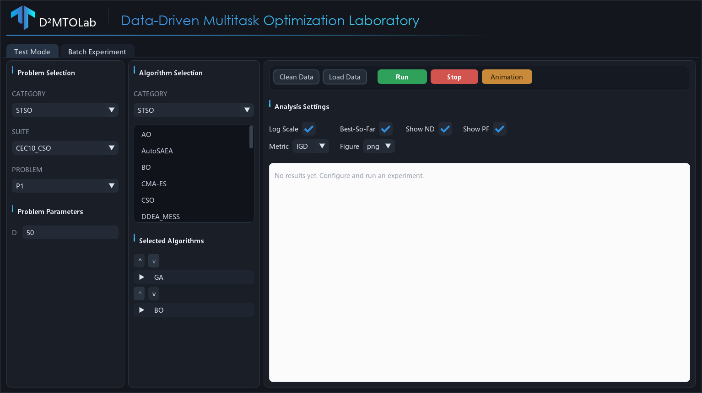
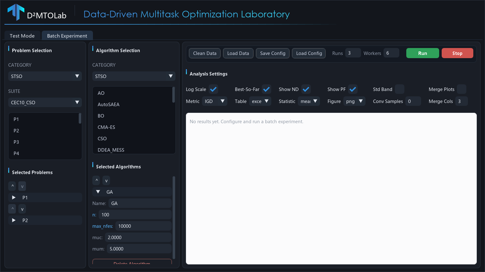
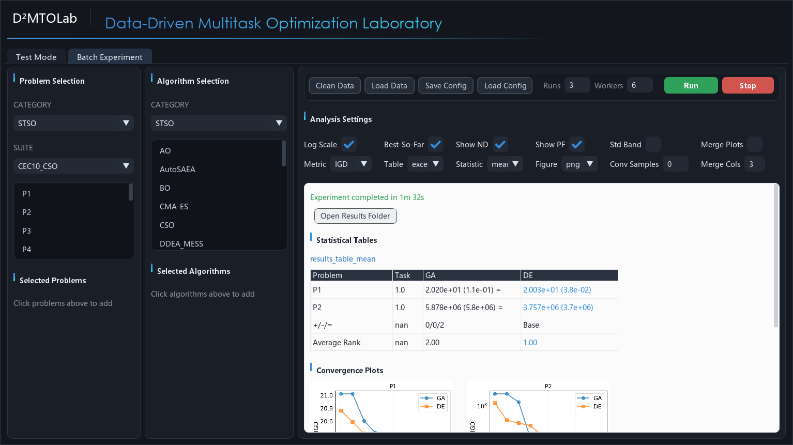

.. _gui:

Desktop GUI
===========

D²MTOLab ships an experimental desktop GUI built with
`DearPyGui <https://github.com/hoffstadt/DearPyGui>`_. It exposes the full
experiment workflow — choose problems and algorithms, configure parameters,
run, and view analysis tables and figures — without writing any code.

The GUI lives in the ``ui/`` directory of the repository. It is **not** part
of the PyPI package, so use a source checkout to run it.

Installation
------------

The GUI needs the core package plus a few UI-only dependencies:

.. code-block:: bash

   # From a source checkout of the repository
   git clone https://github.com/JiangtaoShen/DDMTOLab.git
   cd DDMTOLab
   pip install -e .

   # UI dependencies (DearPyGui, Pillow, pandas, openpyxl)
   pip install -r ui/requirements.txt

   # Launch
   python ui/main.py

.. note::

   The GUI requires a graphical display. On a headless machine (e.g. a remote
   server) run experiments through the Python API or
   :class:`~ddmtolab.Methods.batch_experiment.BatchExperiment` instead.

Layout
------

The window opens on two tabs — **Test Mode** and **Batch Experiment** — that
share the same three-column layout:

* **Problem Selection** (left) — pick a category, suite, and problem, then set
  problem parameters (``D``, ``M``, ``K``, ``Kp``) where the suite allows them.
* **Algorithm Selection** (middle) — pick an algorithm category and click
  algorithms to add them. Each selected algorithm becomes a collapsible card
  where you can rename it, edit its parameters, and reorder or remove it.
* **Toolbar & Results** (right) — run controls and analysis settings on top, a
  scrollable results panel (tables and figures) below.

The algorithm category follows the problem category automatically, and only
algorithms compatible with the chosen problem are offered. Incompatible
combinations (for example, a single-objective algorithm on a multiobjective
problem, or an equal-dimension algorithm on unequal-dimension tasks) are
reported before the run starts rather than failing midway.

Test Mode
---------

Test Mode runs each selected algorithm **once** on a single problem and shows
the per-run analysis: a results table, convergence curves, non-dominated
solution plots (for multiobjective problems), and a runtime comparison.

**Workflow**

1. Select a problem category, suite, and problem on the left.
2. Adjust problem parameters if needed.
3. Select one or more algorithms in the middle column and edit their parameters.
4. Choose analysis options (metric, log scale, figure format, ...).
5. Click **Run**.

**Toolbar**

.. list-table::
   :header-rows: 1
   :widths: 20 80

   * - Button
     - Action
   * - **Run**
     - Run the selected algorithms sequentially and generate analysis.
   * - **Stop**
     - Interrupt the current run.
   * - **Clean Data**
     - Clear the working ``Data``/``Results`` folders (optionally backing up first).
   * - **Load Data**
     - Re-analyze a previously saved data folder without re-running.
   * - **Animation**
     - Generate a convergence animation (GIF/MP4) from the last run's data.

Batch Experiment
----------------

Batch Experiment runs **multiple algorithms** on **multiple problems** for a
configurable number of independent runs, using parallel worker processes, then
produces statistical tables (mean/median with standard deviation and rank-sum
significance markers) and aggregated plots.

**Workflow**

1. Select a problem category and suite, then click problems to add them.
2. Select algorithms and edit their parameters.
3. Set **Runs** (independent repetitions) and **Workers** (parallel processes).
4. Configure analysis settings (metric, table format, statistic type, ...).
5. Click **Run**.

**Save / Load Config**

The **Save Config** and **Load Config** buttons persist the full experiment
setup — selected problems and algorithms, their parameters, run settings, and
analysis options — to a YAML file. The saved file is compatible with
:meth:`~ddmtolab.Methods.batch_experiment.BatchExperiment.from_config`, so a
GUI-designed experiment can also be launched from a script.

Results
-------

Both modes render results on a light panel: statistical tables (best values
highlighted), convergence plots, non-dominated fronts, and runtime bars. Use
**Open Results Folder** to open the output directory, or right-click a figure
to copy it or reveal it in the file browser. All outputs are also written to
the ``tests/Data`` and ``tests/Results`` folders next to the ``ui/`` package.

